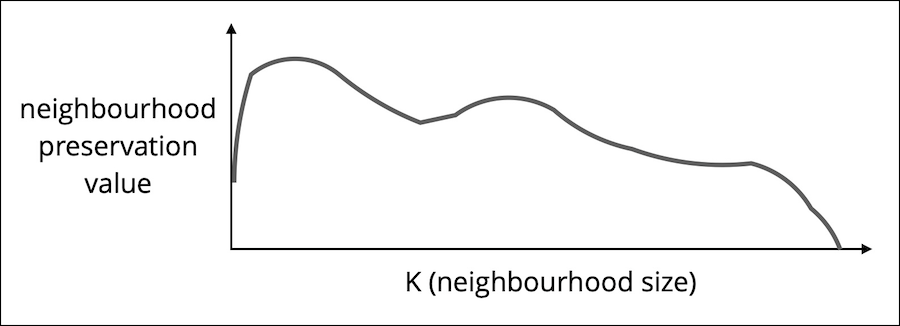
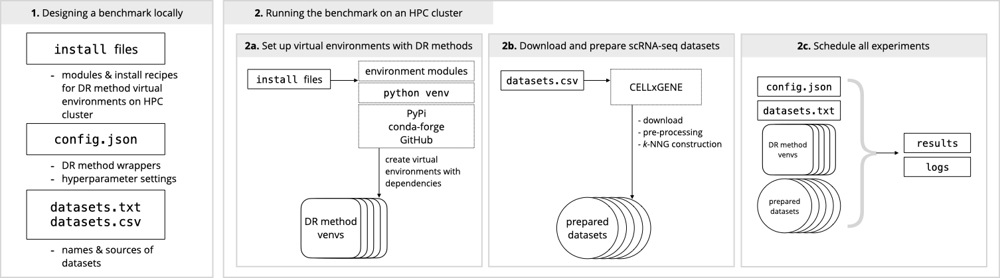

ViScore (*vee-score*) is a toolkit for evaluating and benchmarking dimensionality reduction.

It is published together with [ViVAE](https://github.com/saeyslab/ViVAE), a tool for single-cell data denoising and dimensionality reduction.

## Why use ViScore

* ViScore evaluates structure preservation (SP) by DR using [RNX curves](https://www.sciencedirect.com/science/article/abs/pii/S0925231215003641), independent of any labelling of points.
    * We extend RNX-based scoring to evaluate **Local** and **Global** SP separately.
    * We use accurate approximations of RNX curves to newly enable this scoring for large datasets without O(n^2) complexity, which had previously made its use prohibitive in many cases.
* ViScore enables supervised scoring of cell population embeddings using **xNPE**, an extension of the [Neighbourhood Proportion Error](https://github.com/akonstodata/NPE).
    * xNPE detects positional and shape distortion of labelled populations of points and compares them between embeddings.
* ViScore helps visualise distortions of populations using **neighbourhood composition plots**.
    * Neighbourhood composition plots compare the neighbourhoods of a population in terms of neighbourhood labels, comparing low-dimensional embeddings and the high-dimensional input data.
* We offer a **scalable benchmarking framework** powered by ViScore to compare DR methods on multiple datasets.

## Installation

ViScore is a Python package.
We recommend creating a new Anaconda environment for ViScore, or using the one you may have already created for *ViVAE*.

On Linux or macOS, use the command line for installation.
On Windows, use Anaconda Prompt.

<details>
<summary><b>Stand-alone installation</b></summary>


```bash
conda create --name ViScore --channel conda-forge python=3.11.7 \
    numpy==1.26.3 numba==0.59.0 matplotlib==3.8.2 scipy==1.12.0 pynndescent==0.5.11 scikit-learn==1.4.0 pyemd==1.0.0
conda activate ViScore
pip install --upgrade git+https://github.com/saeyslab/ViScore.git
```

</details>

<details>
<summary><b>Shared environment with ViVAE</b></summary>


```bash
conda activate ViVAE
pip install pyemd==1.0.0
pip install --upgrade git+https://github.com/saeyslab/ViScore.git
```

</details>

## Usage

* `ViScore.score` quantifies Local and Global SP without the use of labels (higher is better).
* `ViScore.xnpe` quantifies local distortion of labelled populations (lower is better).
* `ViScore.neighbourhood_composition_plot` shows sources of error in local embeddings of labelled populations.

Each of these functions is documented: for example, use `help(ViScore.score)` to find out more about Local and Global SP scoring.

We provide tutorials on using our DR method, [ViVAE](https://github.com/saeyslab/ViVAE), with scRNA-seq data ([here](https://colab.research.google.com/drive/163qmAKIc9CcpWSJQzo47OwIUlt9QPzE2?usp=sharing)) data and cytometry data ([here](https://github.com/saeyslab/ViVAE/blob/main/example_cytometry.ipynb)).
These tutorials include the ViScore for evaluation of results.

<details>
<summary><b>Objective structure-preservation scoring</b></summary>


ViScore enables unsupervised assessment of structure preservation in LD embeddings of HD data using scores based on RNX curves.
This is an objective approach based on quantifying neighbourhood preservation between HD and LD for all neighbourhood scales.

RNX curves show (scaled) overlap between neighbour ranks for all neighbourhoods of size from 1 to N-1.



* Taking the AUC (Area-Under-Curve) with *logarithmic* scale for *K* (neighbourhood size), we effectively up-weight the significance of local neighbourhoods, *without* setting a hard cut-off for what is still considered local. This is the **Local SP score** (SL).

* Taking the AUC with linear scale for *K*, we dispense with the locality bias and assume equal importance for all neighbourhood scales. This is the **Global SP score** (SG).

Both of these values are bounded by -1 and 1 (higher is better), where 0 corresponds to SP by a random embedding.

Since the computation of an RNX curve has quadratic complexity, this approach is impractical or impossible to apply to larger datasets.
We circumvent this by approximating the RNX curve using a repeated vantage point tree-based sampling approach.
This is implemented in `ViScore.score`.

</details>

## Benchmarking

You can find our documented benchmarking set-up for comparing DR methods on scRNA-seq data in the [`benchmarking` directory](https://github.com/saeyslab/ViScore/blob/main/benchmarking).



## Pre-print

The pre-print of our publication is available [here](https://www.biorxiv.org/content/10.1101/2023.11.23.568428v2) on bioRxiv.

It describes underlying methodology of ViVAE and ViScore, reviews past work in dimensionality reduction and evaluation of it and links to publicly available datasets on which performance of ViVAE was evaluated.
**We are heavily revising this pre-print.**
