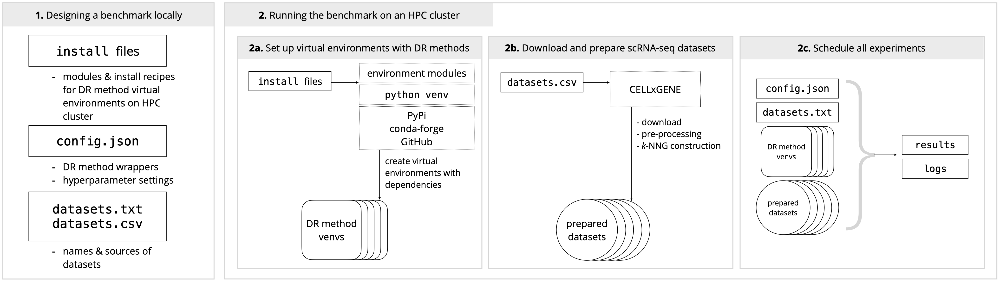

# Single-cell dimensionality reduction benchmarking framework

<small>
**Corresponding author:** [David Novak](https://github.com/davnovak)

Terms and conditions from the ViScore [**LICENSE**](https://github.com/saeyslab/ViScore/blob/main/LICENSE) apply.

**Citation:** Novak, D., de Bodt, C., Lambert, P., Lee, J. A., Van Gassen, S., & Saeys, Y. (2024). Interpretable models for scRNA-seq data embedding with multi-scale structure preservation. bioRxiv. doi:10.1101/2023.11.23.568428
</small>

<hr>

This document will guide you through the deployment of single-cell dimensionality reduction benchmarks on an HPC cluster.

#### Table of contents <!-- omit in toc -->
0. [Introduction](#introduction)
1. [Preparing datasets](#preparing-datasets)
2. [Preparing methods](#preparing-methods)
3. [Running a single experiment](#single-experiment)
4. [Benchmark on an HPC cluster](#hpc-benchmark)
5. [Reporting results](#reporting)
6. [*ViVAE* benchmark specifications](#vivae-benchmark)
7. [Limitations of this framework](#limitations)

<a name="introduction"></a>

## **0.** Introduction

Dimensionality reduction (DR) is a key component in single-cell analysis workflows.
DR helps interpret complicated biological data and, in exploratory analyses, aids in hypothesis formulation.
Despite its crucial role, DR methods remain often misinterpreted and under-evaluated.

**We provide an open, extensible and customisable framework benchmarking and hyperparameter optimisation of DR**, implemented in Python and Bash.
It facilitates rapid deployment of benchmarks on high-performance computer (HPC) clusters.
While designed primarily for scRNA-seq data, the workflow generalises to other tabular data easily.



<details>
<summary><b>Challenges in evaluating DR</b></summary>
<br>

The high dimensionality and sparsity of single-cell 'omics data deems the tasks of structure learning and embedding challenging.
Additionally, evaluating the correctness of embeddings is non-trivial.

The embedding task is hard mainly due to high numbers of features: *eg.* tens of thousands in scRNA-seq.
The evaluation task is hard mainly due to increasing numbers of cells measured in single-cell experiments: nowadays, experiments can include hundreds of thousands or millions of cells.
The [Open Problems in Single-Cell Analysis page](https://openproblems.bio/results/dimensionality_reduction/) offers more context.

<hr>
</details>

<details>
<summary><b>Objective evaluation of structure-preservation</b></summary>
<br>

When we wrote [ViVAE](https://github.com/saeyslab/ViVAE), a novel multi-scale structure-preserving DR method, we coupled it with [ViScore](https://github.com/saeyslab/ViScore), a framework for evaluation of lower-dimensional data embeddings.
We introduced an algorithm for the efficient approximation of *RNX curves*, which quantify levels of neighbourhood structure preservation in embeddings across different scales.
This is key, because RNX curves were not applicable to large datasets prior to this, due to high computational complexity.
Now we have an objective scoring method which quantifies local and global structure preservation, separately.

<hr>
</details>

<details>
<summary><b>Denoising of input data</b></summary>
<br>

We have shown that our ViVAE algorithm works better if a simple nearest-neighbour-based denoising algorithm is applied to the input data matrix.
To isolate the effect of denoising, we run each method with non-denoised and denoised inputs, to see whether the denoising improves results for other methods.
This can be omitted.

<hr>
</details>

ViScore is easy to use directly on your local machine with any DR embeddings, and we provide code examples for doing so in the [ViVAE GitHub repository](https://github.com/saeyslab/ViVAE).
We also give instructions on running the benchmark locally throughout this tutorial.
However, larger evaluations should be run on HPC clusters.
This framework is mainly for users with access to one.

You will need to adapt some code to get things running with your set-up, but we did most of the work for you.

**This framework is written for a Unix(-like) OS (Linux, macOS) with Bash (>=3.2) and [`jq`](https://jqlang.github.io/jq/).
It is light-weight and independent of Snakemake or NextFlow.**

<a name="preparing-datasets"></a>
 
## **1.** Preparing datasets 

The first step in our set-up is identifying datasets to test our DR methods on.

The easiest way to acquire high-quality scRNA-seq data is to download it from a database ([CELLxGENE](https://cellxgene.cziscience.com), [Single Cell Portal](https://singlecell.broadinstitute.org/single_cell)).

<details>
<summary><b>Dataset preparation steps</b></summary>
<br>

Preparing a dataset involves

* data download and import
* pre-processing of transcript counts/expression data (may be memory-intensive)
* extraction of cell labels
* construction of a *k*-nearest-neighbour graph (*k*-NNG) on pre-processed data
* de-noising of pre-processed data (using the *k*-NNG)
* construction of *k*-NNG on de-noised pre-processed data

The outputs, for `${OUT}` being the output directory and `${DAT}` the name of a dataset, are:

* `${OUT}/${DAT}_input.npy`: pre-processed transcript count/expression data
* `${OUT}/${DAT}_knn.npy`: *k*-NNG built on inputs
* `${OUT}/${DAT}_input_denoised.npy`: inputs de-noised using *k*-NNG
* `${OUT}/${DAT}_knn_denoised.npy`: *k*-NNG built on denoised inputs
* `${OUT}/${DAT}_labels.npy`: labels of cells assigned by data authors
* `${OUT}/${DAT}_unassigned.npy`: label corresponding to unassigned cells
* `${OUT}/${DAT}_knn_time.npy`: time to build *k*-NNG on inputs (in seconds)
* `${OUT}/${DAT}_knn_denoised_time.npy`: time to build *k*-NNG on de-noised inputs (in seconds)

The *k*-NNG construction is done so as to provide a pre-computed graph to methods that use it.
(When reporting running times, we need to be include *k*-NNG construction where applicable.)

De-noising is designed for ViVAE, but any DR method can be tested with de-noised inputs.
In that case, if the method requires a *k*-NNG, the one constructed on de-noised data will be provided.

<hr>
</details>

<details>
<summary><b>OPTION 1: Preparing datasets locally</b></summary>
<br>

To prepare datasets on your local machine, you will need a Python environment with `numpy`, `pandas`, `ViScore` and [`scanpy`](https://github.com/scverse/scanpy/tree/ad657edfb52e9957b9a93b3a16fc8a87852f3f09) installed.

* To prepare a dataset of interest step-by-step, use `00_prepare_dataset.ipynb`.
* To download and prepare multiple CELLxGENE datasets, run `00_prepare_datasets.py`, which reads from `datasets.csv`.

<hr>
</details>

<details>
<summary><b>OPTION 2: Preparing datasets on HPC cluster</b></summary>
<br>

You can also use the HPC to prepare your datasets.
In that case, take a look at `datasets.csv`, add links and names to datasets you want to use in your benchmark and proceed further through the tutorial; instructions on dataset preparation will be given in [section 4](#hpc-benchmark).

<hr>
</details>

<a name="preparing-methods"></a>

## **2.** Preparing methods

The next step is to set up which DR methods to evaluate, including their exact set-ups (hyperparameter values).

There are 3 components to this stage of configuring your benchmark:

* `config.json` specifies how to use each DR method in Python.
* Files in `./install` specify [environment modules](https://modules.readthedocs.io/en/latest/) and required Python modules to run each DR method.
* `datasets.txt` lists all datasets to evaluate the methods on in the benchmark.

<details>
<summary><b><i>config.json</i></b></summary>
<br>

We use `config.json` to set up hyperparameters for each tested method.
This is already set up for you, but you can modify or extend it.
The JSON file structure is the following:

```json
"methods":
    $method name$:
        "venv":        $name of corresponding virtual environment$
        "cluster":     $either "CPU" or "GPU" to specify resources to use$
        "package":     $name of the Python module$
        "model_class": $name of the model class with a constructor and a `.fit_transform` method$
        "init_args":
            $names of arguments to model constructor$: $values$
            ...
        "fit_transform_args":
            $names of arguments to fit_transform method (except for X~the data)$: $values$
            ...
        "xdim_arg":
            "method": $whether input dimensionality is specified in constructor ("init") or fit_transform method ("fit_transform") or nowhere ("")$
            "name":   $name of the argument$
        "zdim_arg":
            "method": $whether target embedding dimensionality is specified in constructor ("init") or fit_transform method ("fit_transform") or nowhere ("")$
            "name":   $name of the argument$
        "seed_arg":
            "method": $whether random seed is specified in constructor ("init") or fit_transform method ("fit_transform") or nowhere ("")$
            "name":   $name of the argument$
        "knn_arg":
            "method": $whether pre-computed k-NNG is specified in constructor ("init") or fit_transform method ("fit_transform") or nowhere ("")$
            "name":   $name of the argument$
            "format": $whether the format is an array of k-NN indices ("array"), list of index and distance arrays ("list") or tuple of index and distance arrays ("tuple")$
            "k":      $number of nearest neighbours to use$
    ...
```

(This assumes an `sklearn`-like API where each DR method's module contains a model class with a constructor and a `fit_transform` method.
If that is not the case, you need to provide a wrapper.)

Make sure that you do not hard-code target embedding dimensionality (`zdim_arg`) or random seed (`seed_arg`) values in the `init_args` or `fit_transform_args`.
Also consider using the `knn_arg` specification to pass a pre-computed *k*-nearest-neighbour graph to your method (if your method needs one and allows you to compute it yourself up front).

<hr>
</details>

<details>
<summary><b><i>datasets.txt</i></b></summary>
<br>

`datasets.txt` contains names of datasets to include in the benchmark, separated by newlines.
If you have already prepared your datasets locally, the dataset names need to match corresponding file names.
If you want to prepare your datasets on the HPC cluster, the dataset names to match corresponding entries in `datasets.csv`.

You can choose not to include all the datasets in `datasets.txt`.

<hr>
</details>

<details>
<summary><b><i>install/...</i></b></summary>
<br>

Each method listed in `config.json` specifies a `venv` ([virtual environment](https://docs.python.org/3/library/venv.html)) to use.
Each virtual environment needs instructions for installing required Python modules in it: these need to be in the corresponding `./install/${venv}_install.sh` file.
**Each virtual environment needs have at least `numpy` installed (for loading inputs).**

To take advantage of [environment modules](https://modules.sourceforge.net) available on your HPC, you can specify which modules to load before installing or activating the venv.
This needs to be specified in the `./install/${venv}_environment.txt` file.
If no environment modules are required, leave this file empty.

The `_environment` files we include use environment modules available on our HPC.
They might not be available on yours, in which case you need to adapt the module names or add install instructions for whichever packages need to be built in the venv (in the `_install` script).
Typically, environment modules with at least a specific Python version and a corresponding CUDA-accelerated TensorFlow and PyTorch will be available (use `module spider ...` to find out).

**If you are running your benchmark locally, leave `_environment` files empty and define the full installation procedure in `_install` files.**

<hr>
</details>

<a name="single-experiment"></a>

## **3.** Running a single experiment

If you do not have access to an HPC, or you want to test your set-up first, you can already run a method and score it locally.

You will need to run the `02a_run_method.py` and `02b_score_method.py` scripts from your command line.

<details>
<summary><b>Required arguments to run a single experiment</b></summary>
<br>

You will need to specify

* the DR `--method` name
* the prepared `--dataset` name
* the target dimensionality (`--zdim`) of embedding
* whether to use `--denoised` inputs (0/1/2 where 2~only for ViVAE)
* value of random `--seed` for reproducibility (integer)
* path to `--input` files
* path to where `--output` files should be saved
* path to the JSON `--config` file containing settings for your method
* whether to `--save` the trained model (0/1)
* whether progress messages should be printed (`--verbose`) (0/1)

Full description of all arguments can be viewed using `python ./02a_run_method.py --help` and `python 02b_score_method.py --help`.

After running `02a_run_method.py`, a results directory will be created in `--output`, named as `${dataset_name}_${method}_z${zdim}`.
There you will find:

* `emb_seed${seed}.npy`: generated embedding as a NumPy array binary
* `time_seed${seed}.npy`: running time
* `model_seed${seed}.pkl`: binary of trained model (if `--save` was set to 1)

Then, after running `02b_score_method.py`, you will also find:

* `sp_local_seed${seed}.npy`: local structure-preservation score
* `sp_global_seed${seed}.npy`: global structure-preservation score
* `rnx_curve_seed${seed}.npy`: RNX curve
* `xnpe_seed${seed}.npy`: xNPE scores

These results can be visualised in informative plots (see [section 4](#reporting)).

<hr>
</details>


<a name="hpc-benchmark"></a>

## **4.** Benchmark on an HPC cluster

With your benchmark set up, you can migrate your files to the HPC and schedule all benchmarking jobs.

On the HPC, we will be calling the following scripts:

* `01_schedule_venv_creation.sh` to create all virtual environments for DR methods
* `02_schedule_dataset_preparation.sh` to prepare data if you have not prepared it already
* `03_schedule_benchmark.sh` to schedule jobs to run the entire benchmark

<details>
<summary><b>Scheduling a full benchmark</b></summary>
<br>

We assume

* `${HPC}` is the address of an HPC to which you can connect via [SSH](https://en.wikipedia.org/wiki/Secure_Shell).
* `${DATADIR}` is the path to your data storage directory on the HPC.
* `${WORKDIR}` is the path to your personal work/scratch directory on the HPC.
* `${USE_CPU_CLUSTER}` and `${USE_GPU_CLUSTER}` are commands to switch to either a CPU or GPU cluster of your HPC (eg. something like `module swap cluster/cpucluster`).

```bash
## Copy data to HPC (only if you already prepared it)

scp -a ./data/. ${HPC}:${DATADIR}

## Copy scripts and configuration files to HPC

scp -r ./install ./00* ./01* ./02* ./03* ./config.json ./datasets.txt ./datasets.csv ${HPC}:${WORKDIR}

## Connect to HPC

ssh ${HPC}
cd ${WORKDIR}
chmod +x *.sh ./install/*.sh # make scripts executable

## Create virtual environments

eval ${USE_CPU_CLUSTER}
./01_schedule_venv_creation.sh -c CPU # this also creates venv for ViScore
eval ${USE_GPU_CLUSTER}
./01_schedule_venv_creation.sh -c GPU
# wait until done

## Prepare data if you have not already done so
## (This needs CPU venv creation to be finished)

eval ${USE_CPU_CLUSTER}
./02_schedule_dataset_preparation.sh -d ${DATADIR}
# wait until done

## Run benchmarks

eval ${USE_CPU_CLUSTER}
./03_schedule_benchmark.sh -c CPU -i ${DATADIR}
eval ${USE_GPU_CLUSTER}
./03_schedule_benchmark.sh -c GPU -i ${DATADIR}
```

(Upon running `03_schedule_benchmark.sh`, names of separate jobs are printed as they get submitted.)

Note that all 3 `.sh` scripts also allow you to specify amount of computational resources to request (use `--help` to see all arguments).

To check on your running jobs, run:

```bash
${USE_CPU_CLUSTER}
qstat
${USE_GPU_CLUSTER}
qstat
```

<hr>
</details>

<details>
<summary><b>Checking for errors</b></summary>
<br>

Running `03_schedule_benchmark.sh` creates a `logs` directory.
This is where output and error logs for each job are written.

Two of the most likely errors you might encounter are lack of CPU memory and lack of disk space.
To increase amount of requested RAM, use the `-m` flag when running `03_schedule_benchmark.sh` to specify a number of GB (16 is default).
To increase diskspace, delete files or consider running the benchmark in stages (batches by datasets, downloading results after each stage).

While `03_schedule_benchmark.sh` is the easy way to run experiments, you can schedule a single experiment as well.
Check out all options for that using `./03_schedule_experiment.sh --help`.
As an example, to schedule 5 runs (`-s`) of UMAP (`-M`) on the *Reed* dataset (`-D`) with no de-noising (`-u`) using 32 GB of RAM (`-m`) with a walltime of 45 minutes (`-w`), run:

```bash
${USE_CPU_CLUSTER}
./03_schedule_experiment.sh -M UMAP -D Reed -c CPU -z 2 -u 0 -s 5 -i ${DATADIR} -m 32 -w 0:45:0
```

<hr>
</details>

<details>
<summary><b>Downloading benchmark results</b></summary>
<br>

After your benchmark finishes, you can simply copy its results to your machine.
In addition to this, you will probably want to download the manually assigned cell population labels for each dataset for plotting embeddings and k-NNGs for making neighbourhood composition plots in ViScore.

```bash
## From local machine:

scp -r ${HPC}:${WORKDIR}/results .
mkdir -p ./data
scp \
  ${HPC}:${DATADIR}/\*_knn.npy \
  ${HPC}:${DATADIR}/\*_labels.npy \
  ${HPC}:${DATADIR}/\*_unassigned.npy \
  ./data
```

<hr>
</details>

<details>
<summary><b>(Re-)running parts of a benchmark</b></summary>
<br>

It is possible to extend your benchmark design or re-run one part of the benchmark, without re-running everything.

To add new datasets to your benchmark, either copy the prepared datsets to your data directory or include them in `datasets.csv` and `datasets.txt` and re-run `02_schedule_dataset_preparation.sh` with its original arguments.
To re-run experiments with a limited subset of datasets, just edit `datasets.txt` to contain only the names of those relevant datasets.
After this, continue to `03_schedule_benchmark.sh`.

To add new DR set-ups to your benchmark, modify the `config.json` file and `install` files accordingly, and do not include set-ups in `config.json` that have already been fully tested.
If new virtual environments need to be included, re-run the `01_schedule_venv_creation.sh` step.
After this, continue to `03_schedule_benchmark.sh`.

<hr>
</details>

<a name="reporting"></a>

## **5.** Reporting results

Once your benchmark is done, you can copy results back onto your local machine and generate informative plots, using `04_report.ipynb`.
In addition to `numpy`, `pandas`, `matplotlib` and `ViScore` you will need [`funkyheatmappy`](https://github.com/funkyheatmap/funkyheatmappy), [`scipy`](https://github.com/scipy/scipy) and [`adjustText`](https://github.com/Phlya/adjustText).

The workflow is annotated, and you might want to customise some graphical elements to fit your needs.

<a name="vivae-benchmark"></a>

## **6.** *ViVAE* benchmark specifications

In our ViVAE paper, we report results of a benchmark that we run using this framework, with default arguments to the scripts.
In addition to the datasets in `datasets.csv` and `datasets.txt`, we use two additional interesting datasets that are not on CELLxGENE.

<details>
<summary><b><i>Shekhar</i> mouse retina dataset</b></summary>
<br>

This dataset comprises profiles of 44,994 cells from mouse retina.
We picked this dataset because it includes a wide range of annotated populations and it includes a known batch effect, which causes some embeddings to mis-embed some cell populations by exaggerating the technical source variation, relative to biological variation.

We downloaded this dataset using the [`scRNAseq` R package](https://www.bioconductor.org/packages/release/data/experiment/html/scRNAseq.html).
We converted it from a `SingleCellExperiment` object to an H5 readable as a Python `AnnData` object, using `scDIOR`[https://github.com/JiekaiLab/scDIOR].

**Citation:** Shekhar, K., Lapan, S. W., Whitney, I. E., Tran, N. M., Macosko, E. Z., Kowalczyk, M., … Sanes, J. R. (8 2016). *Comprehensive Classification of Retinal Bipolar Neurons by Single-Cell Transcriptomics*. Cell, 166, 1308-1323.e30. doi:10.1016/j.cell.2016.07.054

<hr>
</details>

<details>
<summary><b><i>Farrell</i> zebrafish embryo dataset</b></summary>
<br>

This dataset comprises profiles of 38,731 cells gathered from zebrafish embryos.
We picked this dataset because it includes annotation of ordered developmental stages represented by different cells.
This annotation helps us visualise the gradient from progenitors toward increasingly differentiated cells.
This is an example where the preservation of continuity in trajectories is arguably at least as important as local structure preservation, in order to create a faithful embedding of the expression data.

We downloaded this dataset from the Broad Institute [Single Cell Portal](https://singlecell.broadinstitute.org/single_cell) using accession code `SCP162`.

We also used `URD_Dropseq_Meta.txt` to extract information about developmental trajectories in the data for a case study in the ViVAE paper.

**Citation:** Farrell, J. A., Wang, Y., Riesenfeld, S. J., Shekhar, K., Regev, A., & Schier, A. F. (6 2018). *Single-cell reconstruction of developmental trajectories during zebrafish embryogenesis*. Science, 360. doi:10.1126/science.aar3131

<hr>
</details>

<details>
<summary><b>Pre-processing of the additional datasets</b></summary>
<br>

We pre-process the Shekhar and Farrell datasets using the same methodology as for the other ones, except that we **normalise and log-scale the Shekhar data** first.
This is because we are provided raw counts.
To do this, see `00_prepare_dataset.ipynb` and in section 2, set `counts = True`.

<hr>
</details>

<a name="limitations"></a>

## **7.** Limitations of this framework

If you use our framework and find yourself having to make significant adjustments that improve it, we welcome your pull requests.

<details>
<summary><b>Current limitations</b></summary>
<br>

* **`sklearn`-like API requirement.**
Each method used needs to have a model class with a constructor and `.fit_transform` method.
In other cases, a wrapper is needed (we use a custom wrapper for [SQuad-MDS](https://github.com/davnovak/SQuad-MDS) already).
* **Running time of *k*-NNG construction needs to be measured separately and added where necessary.**
* **Embeddings of unseen points not tested here.**
We could test the performance of `.fit`ting on a training set and `.transform`ing a test set for methods which allow it as part of the benchmark, but currently we do not.
* **Hyperparameter optimisation not included.**
This would grow the benchmark massively, so we choose fixed hyperparameter settings.
However, you can easily set up your `config.json` file to test multiple configurations of the same algorithm.
* **Limited to Python.**
Some amazing DR methods are not implemented in Python (eg. [EmbedSOM](https://bioinfo.uochb.cas.cz/embedsom/), [destiny](https://bioconductor.org/packages/release/bioc/html/destiny.html)), therefore cannot included in this benchmark yet.
* **No special treatment for deterministic algorithms.**
This is a to-do: if a method is deterministic (eg. PCA), it should be possible to indicate this in the config file and only run it once.

<hr>
</details>
